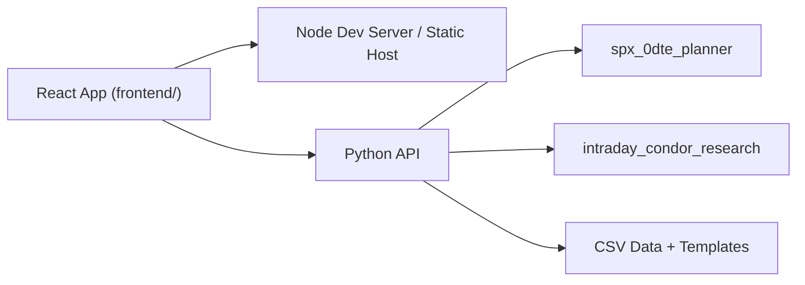

# React Frontend / Python Analytics Split

This document defines the recommended split between:

- a React-backed Node.js frontend project
- a Python analytics service that owns the modeling, regime logic, and quote/vertical scoring

The goal is to improve UX without duplicating any model logic outside Python.

## Decision

Use a two-service architecture:

- `frontend/`
  - React app
  - talks only to a small JSON API
  - owns presentation, local UI state, forms, charts, and saved presets
- `python_api/`
  - thin HTTP layer in Python
  - wraps the existing `spx_0dte_planner` and `intraday_condor_research` code
  - owns all calculations, training, inference, touch tables, continuation logic, and vertical scoring

Do not re-implement analytics in Node.

## Why This Split

The frontend needs:

- richer interactivity
- cleaner state management
- better UX for collapsibles, charts, and dynamic tables
- easier iteration on forms and saved scenarios

The Python side already has:

- feature building
- model fitting
- regime classification
- touch probability logic
- continuation logic
- quote / vertical proxy logic

That logic should remain in Python so there is one source of truth.

## High-Level Architecture



Production-style flow:

1. React loads bootstrap metadata from Python.
2. User edits current-day inputs in React.
3. React posts a scenario request to Python.
4. Python returns:
   - excursion forecast
   - regime context
   - touch tables
   - continuation tables
   - vertical strategy section
5. React renders human-friendly sections.

## Repo Layout

Recommended additions:

- `frontend/`
  - `package.json`
  - `src/`
  - `src/api/`
  - `src/components/`
  - `src/routes/`
- `python_api/`
  - `app.py`
  - `schemas.py`
  - `service.py`

Keep existing packages where they are:

- `spx_0dte_planner/`
- `intraday_condor_research/`

The Python API layer should import those packages directly.

## Backend Responsibilities

Python owns:

- loading daily data
- training cached model state
- live feature row construction
- regime classification
- touch probability generation
- continuation lookup
- quote-driven vertical proxy generation
- stale-chain re-anchoring rules
- value breakpoint evaluation

The Python API should be mostly orchestration and serialization, not new analytics.

## Frontend Responsibilities

React owns:

- page layout
- forms
- local validation
- collapsibles / tabs
- charts and tables
- loading and error states
- saved presets
- query-string synchronization for scenarios

React should not compute:

- probabilities
- regime buckets
- vertical EV / value
- strike translation logic

## API Contract

All responses are JSON.

### 1. `GET /api/v1/bootstrap`

Purpose:

- initialize the frontend
- return metadata and defaults

Response:

```json
{
  "underlyingLabel": "SPX",
  "latestCommonHistoryDate": "2026-04-02",
  "suggestedTradeDate": "2026-04-06",
  "defaultThresholdsPct": [0.25, 0.30, 0.35, 0.40, 0.45, 0.50, 0.55, 0.60, 0.65, 0.70, 0.75, 0.80, 0.85, 0.90, 0.95, 1.00],
  "eventNames": ["FOMC", "CPI", "PPI", "GDP", "Michigan"],
  "defaults": {
    "touchedSide": "upside_touch",
    "touchedThresholdPct": 0.50,
    "verticalWidthPoints": 10,
    "strongProfitThreshold": 1.50,
    "strongRatioThreshold": 0.75,
    "watchProfitThreshold": 0.75,
    "watchRatioThreshold": 0.35
  },
  "dataStatus": {
    "verticalInputsAvailable": true,
    "refreshNote": null
  }
}
```

### 2. `POST /api/v1/scenario`

Purpose:

- primary app request
- takes open-time inputs plus intraday state
- returns the full planning surface

Request:

```json
{
  "predictionDate": "2026-04-06",
  "spxOpen": 6587.92,
  "vixOpen": 25.33,
  "currentSpot": 6595.12,
  "checkpointTime": "13:06",
  "highSoFar": 6645.00,
  "lowSoFar": 6570.00,
  "selectedEvents": ["FOMC"],
  "priorDayOverrides": {
    "spxOpen": null,
    "spxHigh": null,
    "spxLow": null,
    "spxClose": null,
    "vixOpen": null,
    "vixHigh": null,
    "vixLow": null,
    "vixClose": null
  },
  "touchSelection": {
    "touchedSide": "upside_touch",
    "touchedThresholdPct": 0.50
  },
  "verticalSelection": {
    "widthPoints": 10
  },
  "valueBreakpoints": {
    "strongProfitThreshold": 1.50,
    "strongRatioThreshold": 0.75,
    "watchProfitThreshold": 0.75,
    "watchRatioThreshold": 0.35
  }
}
```

Response:

```json
{
  "forecast": {
    "predictedHighFromOpenPct": 0.82,
    "predictedLowFromOpenPct": -0.61,
    "predictedHighPrice": 6641.94,
    "predictedLowPrice": 6547.73
  },
  "intradayState": {
    "currentMovePct": 0.11,
    "highMovePct": 0.87,
    "lowMovePct": -0.27,
    "touchPrice": 6620.86,
    "touchConfirmed": true,
    "touchConfirmationSource": "high_so_far",
    "touchConsistencyLabel": "High so far confirms that the selected upside touch has already happened."
  },
  "regimeContext": {
    "weekday": "Monday",
    "vixRegime": "high_vix",
    "rangeRegime": "mid_prev_range",
    "gapRegime": "small_gap"
  },
  "decisionSummary": {
    "upside": [...],
    "downside": [...]
  },
  "featuredPlaybooks": {
    "upside": {...},
    "downside": {...}
  },
  "touchTables": {
    "upside": [...],
    "downside": [...]
  },
  "continuationTables": {
    "upside": [...],
    "downside": [...]
  },
  "verticalStrategy": {
    "mode": "quote_nearby",
    "pricingProvenance": {
      "pricingMode": "quote_nearby",
      "reanchored": false,
      "filteredCandidateCount": 0,
      "sourceSnapshotCount": 1,
      "maxSnapshotGapPct": 0.8
    },
    "summary": {
      "strategy": "bull_call_debit",
      "outlook": "bullish continuation debit",
      "lowerStrike": 6630.0,
      "upperStrike": 6640.0,
      "entryPrice": 3.07,
      "predictedTerminalValueProxy": 5.33,
      "predictedProfitProxy": 2.26,
      "profitToRiskRatioProxy": 0.74,
      "valueBucket": "watch",
      "valueBucketExplanation": "There is modeled value here, but the edge is thinner and execution matters more."
    },
    "ranked": [...],
    "notes": [
      "Filtered out 4 stale candidates because their quote snapshot underlying was too far from current SPX spot."
    ]
  }
}
```

### Required semantics for touch confirmation

The backend must return both:

- `touchConfirmed`
- `touchConfirmationSource`

Do not leave touch confirmation as label-only text.

Allowed values for `touchConfirmationSource`:

- `high_so_far`
- `low_so_far`
- `spot_only`
- `not_confirmed`

Rules:

- for `upside_touch`, confirmation should come from `highSoFar >= touchPrice`
- for `downside_touch`, confirmation should come from `lowSoFar <= touchPrice`
- `spot_only` should be used only if current spot is beyond the touch level but the realized range does not confirm it
- React should use the structured fields for badges / warnings and treat `touchConsistencyLabel` as explanatory copy only

### 3. `POST /api/v1/refresh-data`

Purpose:

- refresh local SPX / VIX daily CSVs on demand
- optional admin action from the frontend

Request:

```json
{
  "force": false
}
```

Response:

```json
{
  "ok": true,
  "message": "Auto-refreshed local SPX/VIX history through 2026-04-06.",
  "latestCommonHistoryDate": "2026-04-02"
}
```

### 4. `GET /api/v1/health`

Purpose:

- simple uptime / readiness check

Response:

```json
{
  "ok": true,
  "modelLoaded": true,
  "verticalInputsAvailable": true
}
```

## API Rules

These should remain stable:

- Percentages in requests use human-friendly percent units only when the field name ends with `Pct`.
- Raw decimals should be reserved for internal Python model code, not the frontend API.
- Strike and price fields are always absolute index levels.
- The backend returns both:
  - human-facing summary fields
  - detailed table rows

This keeps React simple and avoids re-deriving values on the client.

## Suggested Python Implementation

Use a small API framework:

- preferred: `FastAPI`
- acceptable: `Flask`

Recommended structure:

- `python_api/schemas.py`
  - request/response Pydantic models
- `python_api/service.py`
  - orchestrates calls into `spx_0dte_planner`
- `python_api/app.py`
  - routes only

Also add a cached app-state layer so the backend does not retrain on every request.

Suggested startup behavior:

1. load CSVs
2. fit or load cached range model
3. build regime lookup
4. build continuation lookup
5. build touch-target lookup
6. keep those objects in memory

## Suggested Frontend Implementation

Recommended stack:

- `Next.js` or `Vite + React`
- `TypeScript`
- `React Query` or `TanStack Query`
- `Zod` for runtime response validation if desired

Suggested frontend modules:

- `src/api/client.ts`
  - typed fetch wrappers
- `src/types/api.ts`
  - generated or hand-maintained API types
- `src/features/scenario/`
  - current-day scenario form
- `src/features/forecast/`
  - touch + continuation display
- `src/features/verticals/`
  - strategy-to-watch section

## State Model

Keep three levels of state:

- `bootstrap state`
  - metadata and defaults
- `scenario input state`
  - current form values
- `scenario result state`
  - latest backend response

The frontend should be able to serialize the scenario state into the URL.

## Caching

Python:

- cache model state in memory
- refresh only when data files change or on explicit refresh

Frontend:

- cache `bootstrap`
- do not cache `scenario` aggressively

### Cache safety rules

To avoid stale or mismatched analytics, the Python cache key must include:

- `spx_path`
- `vix_path`
- `events_path`
- latest modified time or content hash of those files
- `train_end_date`
- `max_lag`
- `pca_variance_ratio`
- threshold grid used for:
  - touch probabilities
  - continuation lookup
  - touch-target lookup

If quote-driven vertical inputs are loaded at startup, the cache key should also include:

- `fill_samples_path`
- `quotes_path`
- `vix_snapshots_path`
- latest modified time or content hash of those files

If these values are fixed at service startup rather than request-configurable, the backend should still echo them back in a `modelConfig` object inside:

- `GET /api/v1/bootstrap`
- `POST /api/v1/scenario`

This prevents the frontend from silently drifting away from backend assumptions.

## Known Risks

- The vertical proxy still depends on sampled or stale quote inputs.
- Re-anchored stale-chain mode is explicitly a fallback, not true chain pricing.
- If the frontend starts re-deriving analytics from backend payloads, the contract will drift.

## Regression Guardrails

These rules should be treated as part of the contract:

1. React must not infer touch confirmation from free-form text.
2. React must not compute regime buckets, EV, or vertical pricing locally.
3. The backend must surface vertical pricing provenance as structured fields, not only notes.
4. The backend must distinguish:
   - nearby quote mode
   - re-anchored stale-chain proxy mode
5. Any field used in user-facing badges or warnings should be returned as typed JSON, not embedded only in prose.

## Recommended Implementation Order

1. Create `python_api/` with `GET /health` and `GET /bootstrap`
2. Move current webapp scenario generation into `POST /scenario`
3. Build minimal React page with the same form fields
4. Port the current summary sections first
5. Port the vertical strategy section second
6. Remove or freeze the WSGI HTML app after parity is reached

## Non-Goals For Phase 1

- auth
- databases
- websocket streaming
- persistent user accounts
- moving model logic into JavaScript

Phase 1 should only replace the presentation layer.
